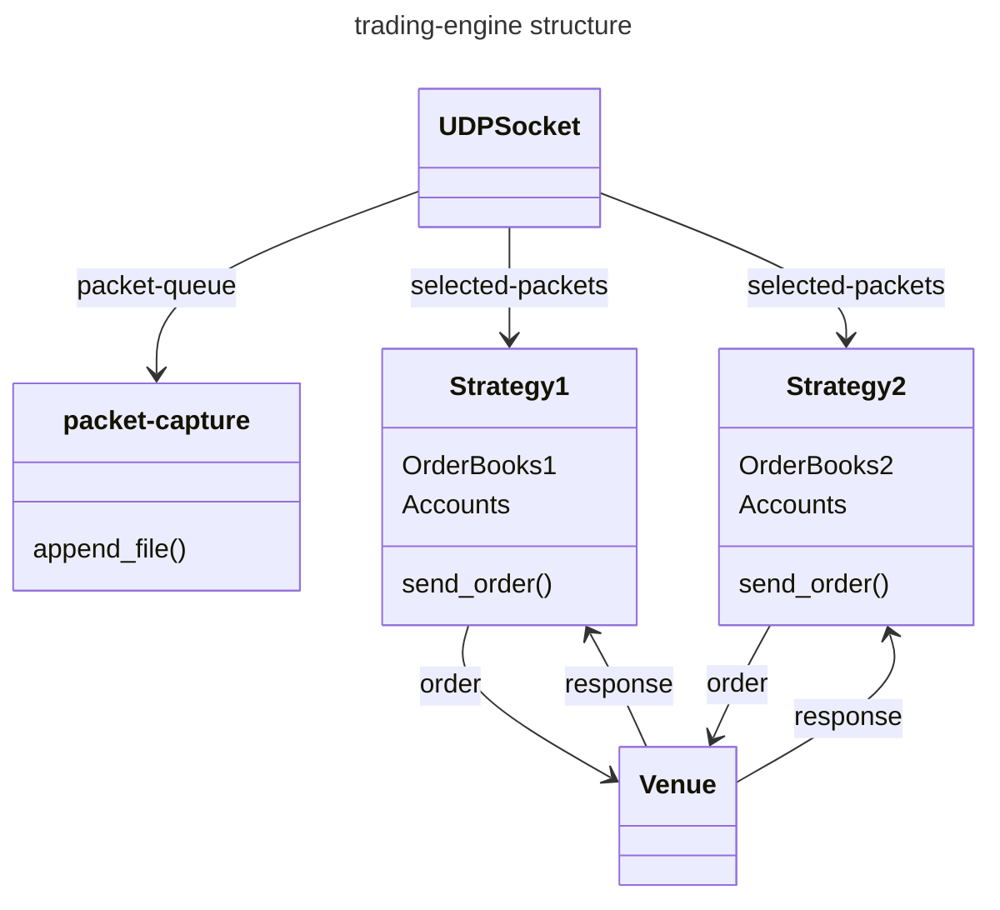

```mermaid
---
title: "trading-engine structure"
---
classDiagram
    UDPSocket --> packet-capture: packet-queue
    UDPSocket --> Strategy1: selected-packets
    UDPSocket --> Strategy2: selected-packets
    Strategy1 --> Venue: order
    Strategy2 --> Venue: order
    Strategy1 <-- Venue: response
    Strategy2 <-- Venue: response

    class Strategy1 {
        OrderBooks1
        Accounts
        send_order()
    }

    class Strategy2 {
        OrderBooks2
        Accounts
        send_order()
    }

    class packet-capture {
        append_file()
    }

```